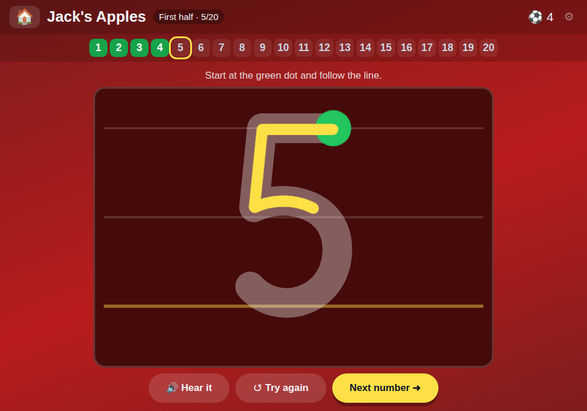

# 🍎 Jack's Apples

**Trace the numbers 1 to 20 with a finger, then fill the missing numbers into a grid of apples**

[](https://jacks-games.github.io/apples/)




## What this is

A Year 1 homework sheet, *Practice Numbers 1–20*, turned into a game. The sheet has two
parts, and so does the game — two halves, like a football match.

**First half — trace.** The numbers 1 to 20 appear one after another over school writing
guides. A green dot and an arrow show where each stroke starts and which way it goes; the
finger has to follow the line, and lifting it half way starts that stroke again. Two-digit
numbers are written digit by digit, tens first.

**Second half — apples.** Twenty apples in four rows of five, in reading order. Some already
carry their number, the rest are empty. The first empty apple pulses; four number tiles sit
underneath, one of them right. Three grids per half, each with more gaps than the last. The
first grid is the homework sheet exactly: 2, 3, 6, 9, 10, 12, 14, 16 and 20 are given.

## 🎮 How to play

### 1️⃣ &nbsp; Find the green dot 🟢
Every number starts in one particular place. The arrow shows the direction.

### 2️⃣ &nbsp; Slide, don't lift 👆
Follow the grey line with one finger. Lift it and that stroke resets.

### 3️⃣ &nbsp; Fill the apples 🍎
"What comes after nine?" — tap the right tile and the apple fills in. A wrong tile just
wobbles and greys out; nothing is lost.

### ⚽ &nbsp; Full time!
Every traced number and every finished grid earns a football. The whole row is counted out
loud at the end of each grid.

## 🎯 What it practises

- ✍️ &nbsp; Forming the digits 0–9 the way school teaches them (a plain 1, an open 4, a 7 without a bar)
- 🔢 &nbsp; The order of the numbers to 20, and *what comes next* from any starting point
- 👂 &nbsp; Hearing every number said aloud in English as it is written or chosen

## ⚙️ How the checking works

Each digit is one to two SVG strokes in a 100 × 140 cell; a two-digit number is two cells side
by side on a 200 × 140 board. Checkpoints are sampled along each stroke with
`SVGPathElement.getPointAtLength()` and must be reached **in order** within a tolerance
radius. Ink is drawn on a `<canvas>` above the SVG using pointer events with
`touch-action: none`, so a finger draws instead of scrolling the page.

`TOL` (17 board units, near the top of the script) is the single knob to turn if it feels too
fussy or too forgiving for a particular child.

## 🎈 The other games

| Game | What it is | |
|---|---|---|
| 📖 [**Jack's Words**](https://github.com/jacks-games/words) | Hear a word, build it from letter tiles, then read it in a sentence | [▶ play](https://jacks-games.github.io/words/) |
| 🥅 [**Jack's Match**](https://github.com/jacks-games/match) | Tell real words from decodable nonsense words, then spell by ear | [▶ play](https://jacks-games.github.io/match/) |
| ✏️ [**Jack's Letters**](https://github.com/jacks-games/letters) | Finger-trace all 26 lowercase letters in the correct stroke order | [▶ play](https://jacks-games.github.io/letters/) |
| 🔢 [**Jack's Numbers**](https://github.com/jacks-games/numbers) | Count, add and subtract with footballs — to 10, then to 20 | [▶ play](https://jacks-games.github.io/numbers/) |
| 🍎 [**Jack's Apples**](https://github.com/jacks-games/apples) | Trace 1–20, then fill the missing numbers into the apple grid | [▶ play](https://jacks-games.github.io/apples/)  👈 **this one** |
| ♟️ [**Jackies Schach**](https://github.com/jacks-games/chess) | Full FIDE rules with a coach that marks the safe squares (German) | [▶ play](https://jacks-games.github.io/chess/) |

All six on one start page: **[jackbenn.ing](https://jackbenn.ing)** — homework games first, chess always last.

## 🛠 Built like this

Every game in this organisation is **one self-contained `index.html`** — no build step, no
framework, no package manager, no analytics, and no network calls once the page has loaded.
That is a deliberate constraint: a game a child depends on should still work in five years,
and a parent should be able to read the whole thing in one sitting.

- **Speech** — the browser's Web Speech API, preferring a British English voice. It always
  waits for a tap first, because Chrome and iOS block audio without user activation.
- **Progress** — kept in `localStorage` on the device. Nothing is collected, sent or stored
  anywhere else.
- **Made for** an iPad mini in either orientation: finger-sized targets, no hover-only
  interactions, `prefers-reduced-motion` respected.

Run it locally:

```bash
python3 -m http.server 8000
```

The start page at [jackbenn.ing](https://jackbenn.ing) is built from
[google814/Jack](https://github.com/google814/Jack), which is the source of truth. The repos
in this organisation are copies kept in step by `tools/sync-game-repos.sh` in that repo, so
each game also has its own page and its own link.
